# Customer Churn Prediction
>- This project aims to minimise financial losses associated with customer search. Instead of plainly focusing on maximizing the accuracy of our model, we focus on other metrics such as precision and recall.
>- Our dataset consists of over 7000 rows and 33 columns of data. It is based in the U.S. state of California.
>- Kaggle link: https://www.kaggle.com/datasets/yeanzc/telco-customer-churn-ibm-dataset

## Initial Data Preprocessing 
- We dropped ['Country', 'State', 'Count', 'CustomerID', 'Zip Code', 'City', 'Latitude', 'Longitude', 'Lat Long', 'Churn Label', 'Churn Reason', 'Churn Score', 'CLTV', 'Total Charges'] columns as they were either redundant(Churn Label, , Lat Long) or useless (Country, State, Count, Customer_ID) correlated (Total Charges (being the product of Tenure Months and Monthly Charges)) or leaking data (CLTV, Total Charges, Churn Score). Latitude and Longitude were plotted on a graph with the churn value being the colour differentiating between them, but we were unable to fetch some meaningful insight.

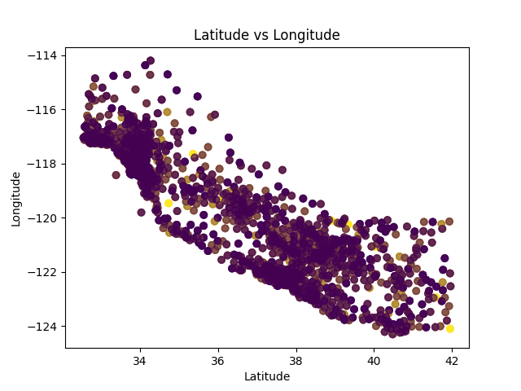

## Data Insights
### Contract vs Churn
- When we plot contract vs churn, we get this heatmap,
 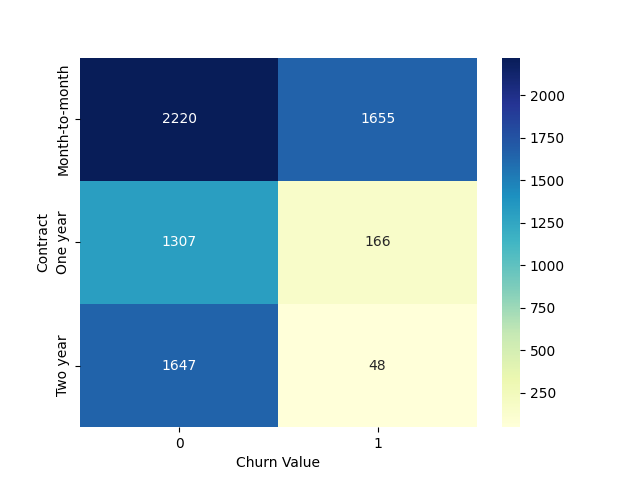
- This heatmap strongly suggests that people with month-to-month contract are most likely to churn, around 42.71% people churn, while for a One Year Contract, around 11.27% churn, while for a Two Year Contract, only around 2.83% people churn. The risk of churn is significantly higher when there is a smaller term contract.
### Contract Terms
- When we plot a boxplot having the values to Tenure Months for all the contract types: Month-to-month, One Year, Two Years, we observe certain outliers.
#### Month-to-Month
 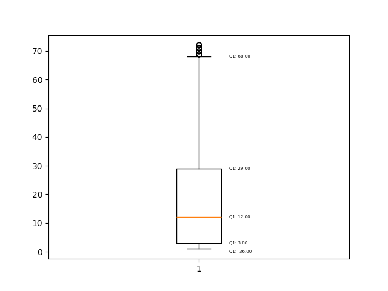
#### One Year
 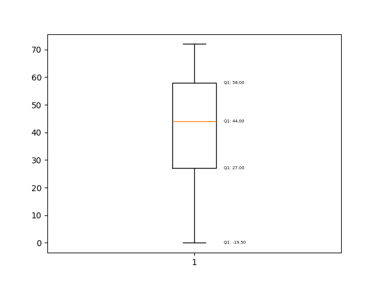
#### Two Years
 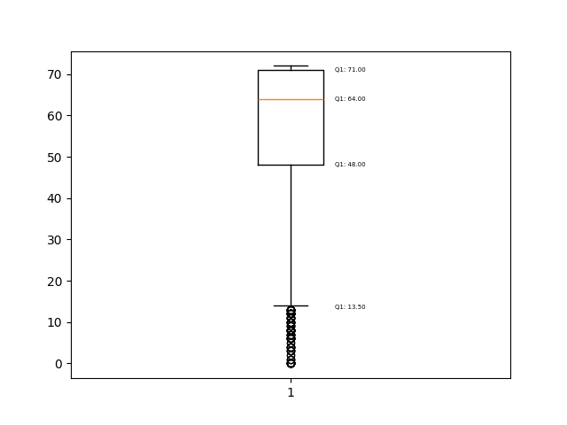

 -There are 17 outliers for Month-to-month and 79 Outliers for Two Years and none for One year. Out of the 17 outliers for Month-to-month, 12 do not churn while 5 churn, which tells that about 70.59% of the outliers are willing to stay. We can also infer that people who have stayed for longer tenure (in terms of months) are more likely to be loyal and not churn. Bigger the term of the contract, greater is the retention rate.

 ## Model Training and Insights
 ### Model 1
 - We applied One-Hot Encoding on all the categorical columns and applied StandardScaler inorder to sent them through the 1st logistic regression pipeline, where we have simple logistic regression. We obtained the following:
 #### ROC Curve
 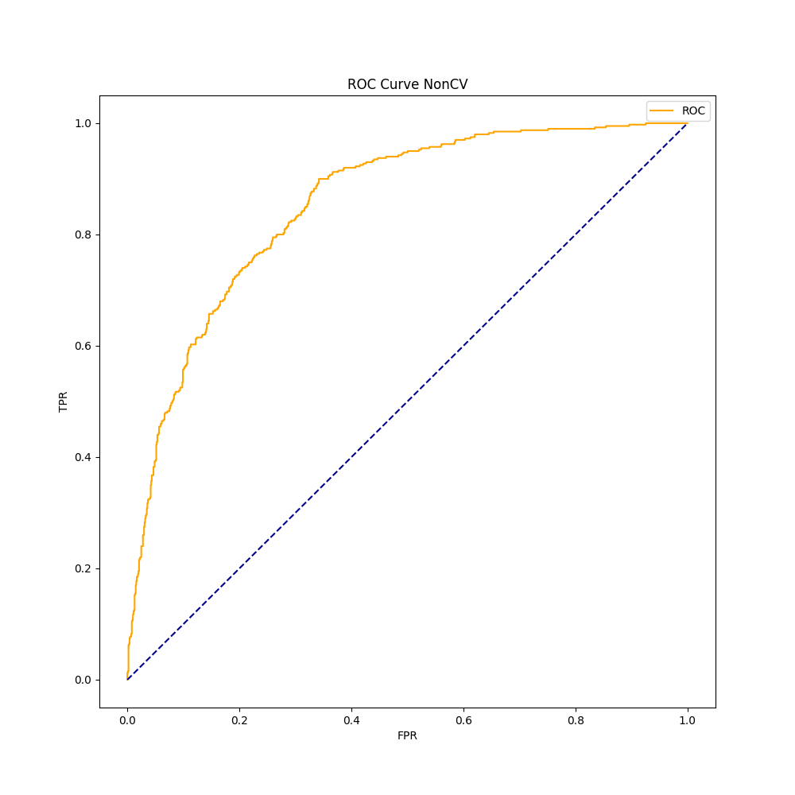
 #### PR Curve
 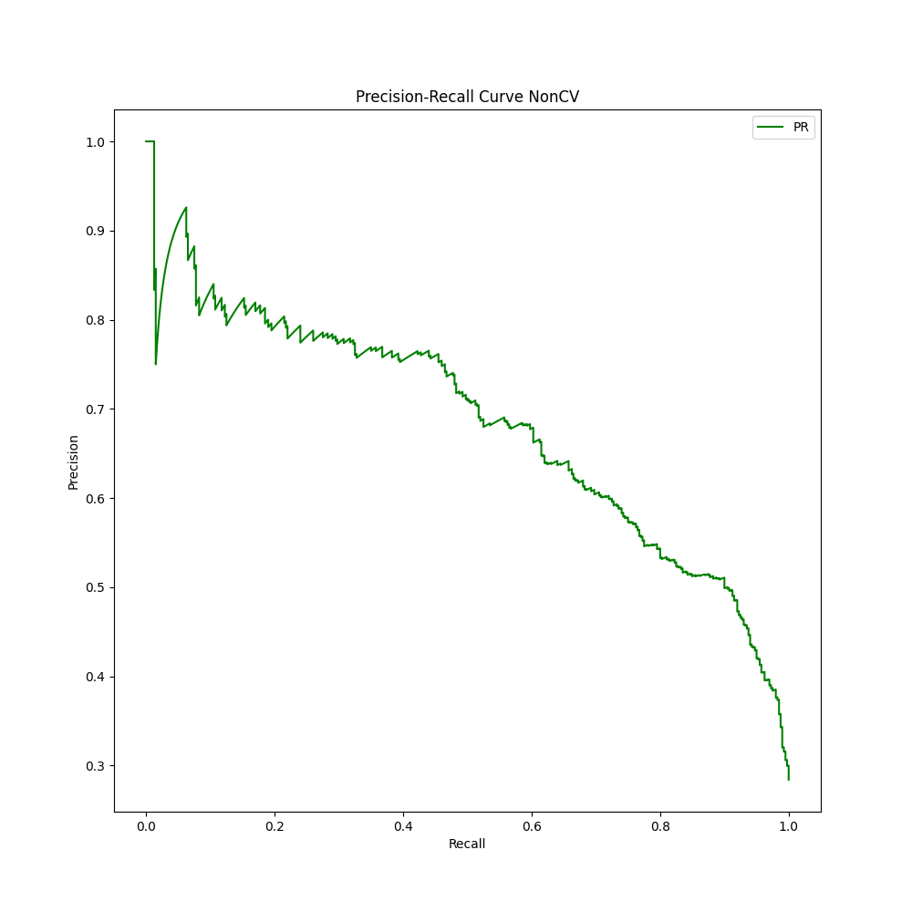
 
| | precision | recall | f1-score | support |
| :--- | :--- | :--- | :--- | :--- |
| 0 | 0.84 | 0.89 | 0.87 | 1009 |
| 1 | 0.68 | 0.57 | 0.62 | 400 |
| **accuracy** | | | 0.80 | 1409 |
| **macro avg** | 0.76 | 0.73 | 0.74 | 1409 |
| **weighted avg** | 0.80 | 0.80 | 0.80 | 1409 |

| Metric | Value |
| :--- | :--- |
| Accuracy_Score | 0.8026969481902059 |
| ROC_AUC_Score | 0.7339816650148662 |

**Confusion_Matrix:**

| | 0 | 1 |
| :--- | :--- | :--- |
| 0 | 901 | 108 |
| 1 | 170 | 230 |

- Cross Validation using StratifiedKFold helps the model to train and test on the entire dataset, smoothening out both the curves and giving us a clearer idea of metrics.
 #### ROC Curve
 
 #### PR Curve
 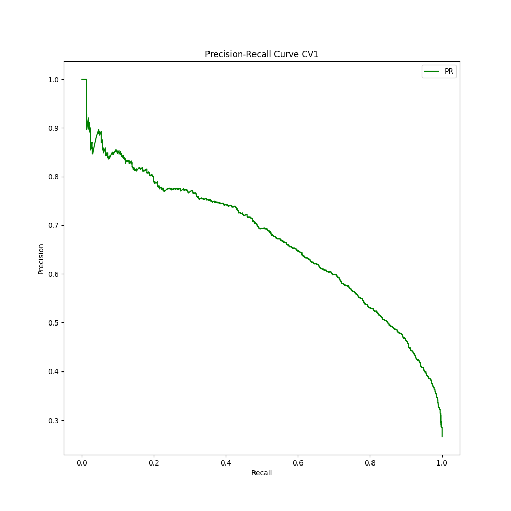

   | | precision | recall | f1-score | support |
| :--- | :--- | :--- | :--- | :--- |
| 0 | 0.85 | 0.90 | 0.87 | 5174 |
| 1 | 0.66 | 0.57 | 0.61 | 1869 |
| **accuracy** | | | 0.81 | 7043 |
| **macro avg** | 0.76 | 0.73 | 0.74 | 7043 |
| **weighted avg** | 0.80 | 0.81 | 0.80 | 7043 |

| Metric | Value |
| :--- | :--- |
| Accuracy_Score | 0.8086042879454778 |
| ROC_AUC_Score | 0.7318285153387631 |

**Confusion_Matrix:**

| | 0 | 1 |
| :--- | :--- | :--- |
| 0 | 4633 | 541 |
| 1 | 807 | 1062 |
 

- Our dataset is imbalanced, the number of rows with label 0 is 2.5 times the number of rows with label 1. The model will be biased towards the majority, which is 0 making accuracy a less reliable, since a dumb model which declares everything as 0 will have an accuracy above 70%.
- Precision of 0 = Out of all declared 0, how many are actually 0
- Precision of 1 = Out of all declared 1, how many are actually 1
- Recall of 0 = Out of all that are actually 0, how many are declared 0
- Recall of 1 = Out of all that are actually 1, how many are declared 1
                                   Pred->  0   1
- In the confusion matrix, we have  0  [[901 108]
                                    1   [170 230]]
- 901 people who were not churning guessed correctly - no loss
- 108 people who arent churning are predicted to churn - more attention to retain them (May lose money in providing discounts/incentives)
- 170 people wo were churning are predicted to stay - they will leave without us paying attention (Lose money as no incentives given)
- 230 people wo were churning predicted to churn - more attention to retain them (Might lower the will of people to leave)

- Our goal is to reduce the people who are actually churning but are predicted to stay as the cost is mostly higher in that case. In order to do that we must reduce the probability threshold to a minimum. If that happens everything will be predicted to churn, which means the increase in the number of false positives drastically(precision 0 drops) and over incentivization, which will cause greater loss. We have to find an equilibrium spot. In this case, we use f1_score, which is the harmonic mean of precision and recall. f1_score will result low if either of the value is low. Maximising it helps us find an equilibrium. 

-We calculate the threshold to be 36.81%. Finding predictions based on this results in:

   | | precision | recall | f1-score | support |
| :--- | :--- | :--- | :--- | :--- |
| 0 | 0.89 | 0.83 | 0.86 | 5174 |
| 1 | 0.60 | 0.71 | 0.65 | 1869 |
| **accuracy** | | | 0.79 | 7043 |
| **macro avg** | 0.74 | 0.77 | 0.75 | 7043 |
| **weighted avg** | 0.81 | 0.79 | 0.80 | 7043 |

| Metric | Value |
| :--- | :--- |
| Accuracy_Score | 0.7949737327843248 |
| ROC_AUC_Score | 0.7680069586935376 |

**Confusion_Matrix:**

| | 0 | 1 |
| :--- | :--- | :--- |
| 0 | 4271 | 903 |
| 1 | 541 | 1328 |


- We have a much better recall score for 1, meaning that out of actual churners, we were able to get 71% of them compared to 57% earlier.

### Model 2
 - We again applied One-Hot Encoding on all the categorical columns and applied StandardScaler inorder to sent them through the 2nd logistic regression pipeline, where we have l1 regression with C = 0.1 for feature selection and outlier handling. We obtained the following:
 #### ROC Curve
 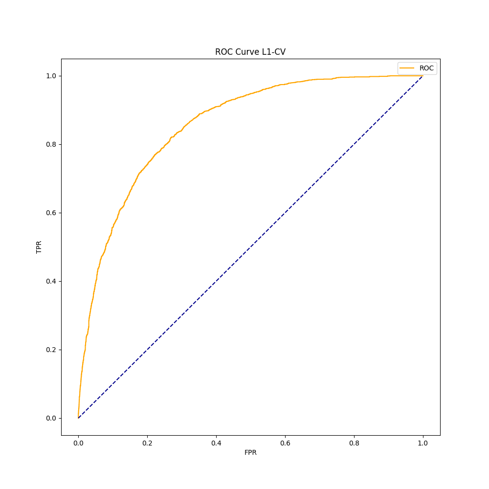
 #### PR Curve
 
 
 
   | | precision | recall | f1-score | support |
| :--- | :--- | :--- | :--- | :--- |
| 0 | 0.85 | 0.90 | 0.87 | 5174 |
| 1 | 0.67 | 0.57 | 0.61 | 1869 |
| **accuracy** | | | 0.81 | 7043 |
| **macro avg** | 0.76 | 0.73 | 0.74 | 7043 |
| **weighted avg** | 0.80 | 0.81 | 0.80 | 7043 |

| Metric | Value |
| :--- | :--- |
| Accuracy_Score | 0.8093142126934545 |
| ROC_AUC_Score | 0.7316281576628253 |

**Confusion_Matrix:**

| | 0 | 1 |
| :--- | :--- | :--- |
| 0 | 4642 | 532 |
| 1 | 811 | 1058 |


- Again we max our f1_score and get threshold as 32.58%:
  

| | precision | recall | f1-score | support |
| :--- | :--- | :--- | :--- | :--- |
| 0 | 0.90 | 0.79 | 0.84 | 5174 |
| 1 | 0.57 | 0.75 | 0.65 | 1869 |
| **accuracy** | | | 0.78 | 7043 |
| **macro avg** | 0.73 | 0.77 | 0.74 | 7043 |
| **weighted avg** | 0.81 | 0.78 | 0.79 | 7043 |

| Metric | Value |
| :--- | :--- |
| Accuracy_Score | 0.7812011926735766 |
| ROC_AUC_Score | 0.771449594765613 |

**Confusion_Matrix:**

| | 0 | 1 |
| :--- | :--- | :--- |
| 0 | 4099 | 1075 |
| 1 | 466 | 1403 |
                   


-Feature Importances:

| Feature | Importance |
| :--- | :--- |
| Gender_Male:	| -0.0026462748018200133 |
| Senior Citizen_Yes:	| 0.03575711428035266 |
| Partner_Yes:	| 0.10125469552383308 |
| Dependents_Yes:	| -0.5712934856801937 |
| Phone Service_Yes:	| -0.054548303020925656 |
| Multiple Lines_No phone service:	| 0.04321674517140039 |
| Multiple Lines_Yes:	| 0.1505271267272631 |
| Internet Service_Fiber optic:	| 0.3888321613180771 |
| Internet Service_No:	| -0.017418331680868628 |
| Online Security_No internet service:	| -7.52075501915996e-05 |
| Online Security_Yes:	| -0.15325137362935046 |
| Online Backup_No internet service:	| 0.0 |
| Online Backup_Yes:	| -0.009196341892987969 |
| Device Protection_No internet service:	| 0.0 |
| Device Protection_Yes:	| 0.00868039617748974 |
| Tech Support_No internet service:	| -0.0804218090827192 |
| Tech Support_Yes:	| -0.1317510561140903 |
| Streaming TV_No internet service:	| -0.09791431222106445 |
| Streaming TV_Yes:	| 0.12082609960504687 |
| Streaming Movies_No internet service:	| -0.12608240348191982 |
| Streaming Movies_Yes:	| 0.09275932490335326 |
| Contract_One year:	| -0.23267921574232217 |
| Contract_Two year:	| -0.5208064806420434 |
| Paperless Billing_Yes:	| 0.17682456157864843 |
| Payment Method_Credit card (automatic):	| -0.041647513968013215 |
| Payment Method_Electronic check:	| 0.14896738201064014 |
| Payment Method_Mailed check:	| 0.0 |
| Tenure Months:	| -0.8764535764494835 |
| Monthly Charges:	| 0.0 |
                   

-The recall for 1 is even better now.
-Certain features such as monthly charges, mailed check payment, device protection_no internet service, online backup_no internet service have vanished due to Lasso (L1) Regression. We have thus performed feature selection and our recall was better.

### Model 3
 - We again applied One-Hot Encoding on all the categorical columns and applied StandardScaler inorder to sent them through the 3rd logistic regression pipeline, where we have l1 regression with C(0.01, 1) and threshold(0.1, 1) optimized using optuna (f1_score maximized). We obtained the following:
 
   |  | precision | recall | f1-score | support |
| :--- | :--- | :--- | :--- | :--- |
| 0 | 0.89 | 0.83 | 0.86 | 5174 |
| 1 | 0.60 | 0.71 | 0.65 | 1869 |
| **accuracy** | | | 0.80 | 7043 |
| **macro avg** | 0.74 | 0.77 | 0.75 | 7043 |
| **weighted avg** | 0.81 | 0.80 | 0.80 | 7043 |

| Metric | Value |
| :--- | :--- |
| Accuracy_Score | 0.796251597330683 |
| ROC_AUC_Score | 0.7681931491428415 |

**Confusion_Matrix:**

| | 0 | 1 |
| :--- | :--- | :--- |
| 0 | 4284 | 890 |
| 1 | 545 | 1324 |

-The recall for 1 is a little lower but f1 score is still high.

```json

{"threshold": 0.370126232374938, "feature_names": ["ohe__Gender_Male", "ohe__Senior Citizen_Yes", "ohe__Partner_Yes", "ohe__Dependents_Yes", "ohe__Phone Service_Yes", "ohe__Multiple Lines_No phone service", "ohe__Multiple Lines_Yes", "ohe__Internet Service_Fiber optic", "ohe__Internet Service_No", "ohe__Online Security_No internet service", "ohe__Online Security_Yes", "ohe__Online Backup_No internet service", "ohe__Online Backup_Yes", "ohe__Device Protection_No internet service", "ohe__Device Protection_Yes", "ohe__Tech Support_No internet service", "ohe__Tech Support_Yes", "ohe__Streaming TV_No internet service", "ohe__Streaming TV_Yes", "ohe__Streaming Movies_No internet service", "ohe__Streaming Movies_Yes", "ohe__Contract_One year", "ohe__Contract_Two year", "ohe__Paperless Billing_Yes", "ohe__Payment Method_Credit card (automatic)", "ohe__Payment Method_Electronic check", "ohe__Payment Method_Mailed check", "remainder__Tenure Months", "remainder__Monthly Charges"]}

```

### Model 4
 - We applied One-Hot Encoding on all the categorical columns to send them through a RandomForest pipeline, which had been decided using optuna while maximising f1_score. We obtained the following:
 #### ROC Curve
 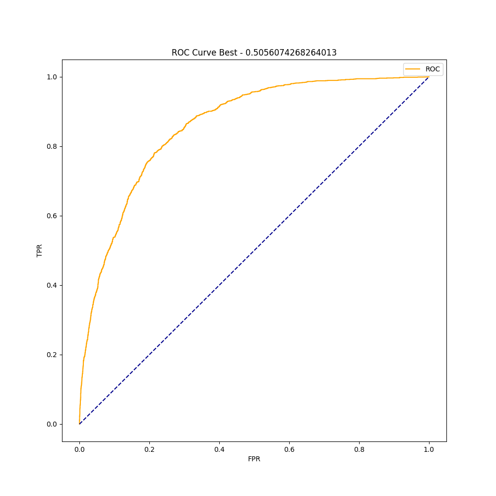
 #### PR Curve
 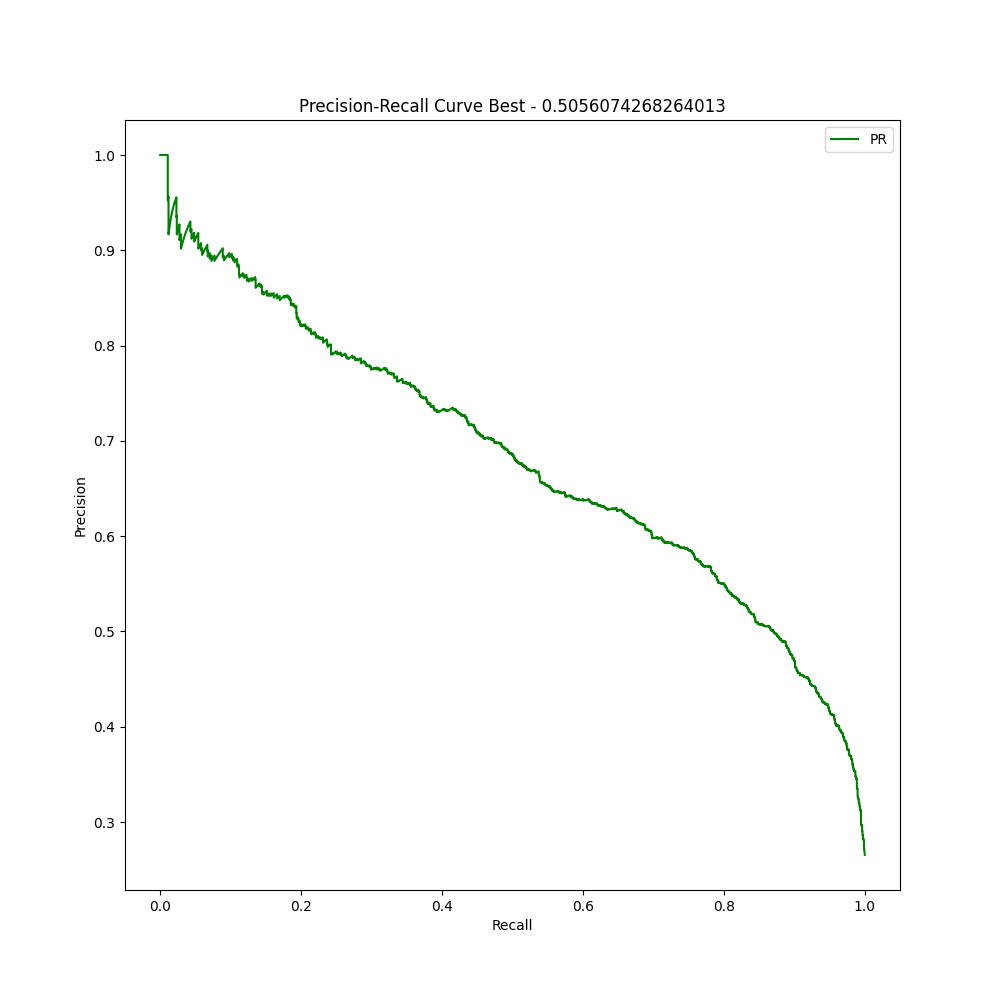
 
 
| | precision | recall | f1-score | support |
| :--- | :--- | :--- | :--- | :--- |
| 0 | 0.90 | 0.81 | 0.85 | 5174 |
| 1 | 0.58 | 0.75 | 0.66 | 1869 |
| **accuracy** | | | 0.79 | 7043 |
| **macro avg** | 0.74 | 0.78 | 0.75 | 7043 |
| **weighted avg** | 0.82 | 0.79 | 0.80 | 7043 |

| Metric | Value |
| :--- | :--- |
| Accuracy_Score | 0.7924180036916086 |
| ROC_AUC_Score | 0.7799383487797467 |

**Confusion_Matrix:**

| | 0 | 1 |
| :--- | :--- | :--- |
| 0 | 4173 | 1001 |
| 1 | 461 | 1408 |

- The recall scores are high, which means that for actual churns, model is able to predict actual churns and for no churns, model is able to predict that with high probabilities. We also have false positives in a large number, but the higher risk false negatives (Type-II Error) has been reduced. The threshold here is higher, as we have used a balanced class weight, which has acted upon the imbalance.

```json

{"threshold": 0.5056074268264013, "feature_names": ["ohe__Gender_Male", "ohe__Senior Citizen_Yes", "ohe__Partner_Yes", "ohe__Dependents_Yes", "ohe__Phone Service_Yes", "ohe__Multiple Lines_No phone service", "ohe__Multiple Lines_Yes", "ohe__Internet Service_Fiber optic", "ohe__Internet Service_No", "ohe__Online Security_No internet service", "ohe__Online Security_Yes", "ohe__Online Backup_No internet service", "ohe__Online Backup_Yes", "ohe__Device Protection_No internet service", "ohe__Device Protection_Yes", "ohe__Tech Support_No internet service", "ohe__Tech Support_Yes", "ohe__Streaming TV_No internet service", "ohe__Streaming TV_Yes", "ohe__Streaming Movies_No internet service", "ohe__Streaming Movies_Yes", "ohe__Contract_One year", "ohe__Contract_Two year", "ohe__Paperless Billing_Yes", "ohe__Payment Method_Credit card (automatic)", "ohe__Payment Method_Electronic check", "ohe__Payment Method_Mailed check", "remainder__Tenure Months", "remainder__Monthly Charges"]}

```

## SHAP Analysis
-We have used SHapely Additive exPlainations to analyze why the model has predicted what it has predicted.
-Firstly we see what the important features are

